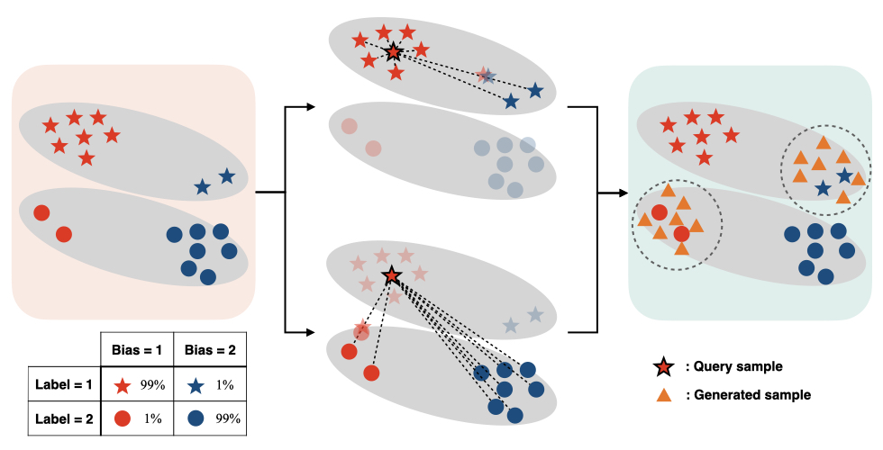

# SelecMix: Debiased Learning by Contradicting-pair Sampling



This repository includes the official PyTorch implementation of our paper:

> [**SelecMix: Debiased Learning by Contradicting-pair Sampling**](https://arxiv.org/abs/2211.02291) <br>
> Inwoo Hwang, Sangjun Lee, Yunhyeok Kwak, Seong Joon Oh, Damien Teney, Jin-Hwa Kim, and Byoung-Tak Zhang <br> 
> *Neural Information Processing Systems (NeurIPS), 2022*

## Running Codes
### Dependency
Run the following command to install some necessary python packages to run our code.
```
pip install -r requirements.txt
```

### Run experiments
```
bash run_script.sh
```

## Reference
If you find our work useful for your research, please consider citing this.
```bib
@inproceedings{hwang2022selecmix,
  title={SelecMix: Debiased Learning by Contradicting-pair Sampling},
  author={Inwoo Hwang and Sangjun Lee and Yunhyeok Kwak and Seong Joon Oh and Damien Teney and Jin-Hwa Kim and Byoung-Tak Zhang},
  booktitle={Advances in Neural Information Processing Systems (NeurIPS)},
  year={2022},
}
```

## Acknowledgements
We use [LfF](https://github.com/alinlab/LfF) as reference code. Thanks!
